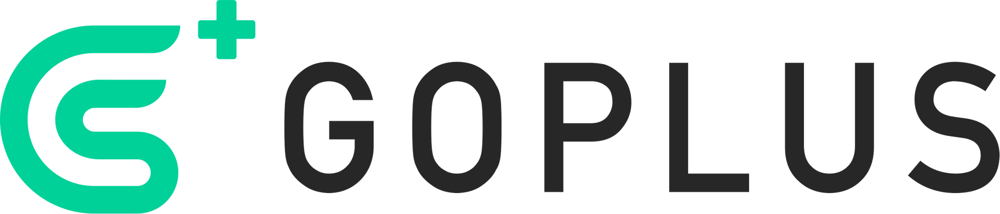

# GoPlus Security

GoPlus is working as the "security infrastructure" for web3 by providing open, permissionless, user-driven security services. GoPlus is building on the security data infrastructure and security service platform, making a safer web3 Ecosystem.
- Official website: https://gopluslabs.io
- Security API documentation: https://docs.gopluslabs.io
- GoPlus ecosystem: https://gopluseco.io
